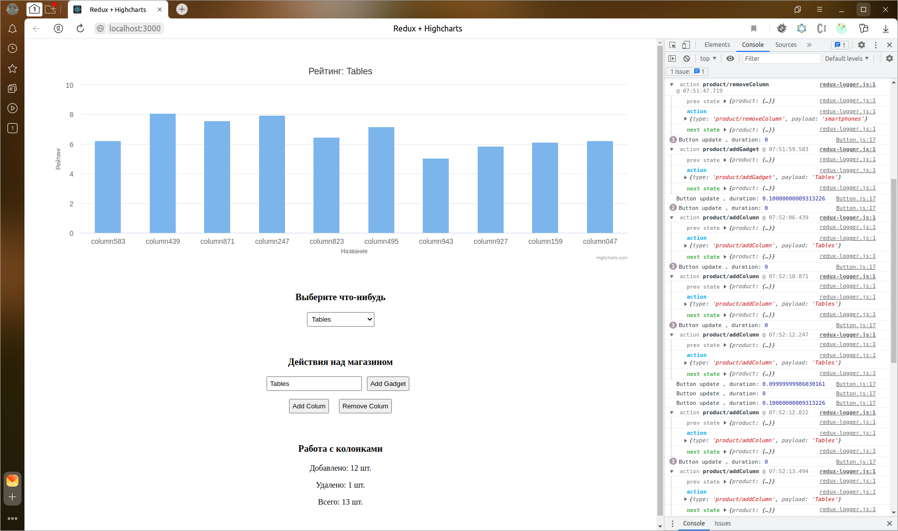

# Diagramming
Data visualization with the Redux and Highcharts library



## Usage
Start application
```shell
docker-compose up -d --build
```

Go to browser: http://localhost:9972/

Logs details
```shell
docker-compose logs -ft chart
```

Stop
```shell
docker-compose down
```